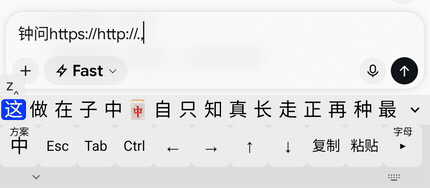

<!--
SPDX-FileCopyrightText: 2026 guyii
SPDX-License-Identifier: GPL-3.0-or-later
-->

# guyii 的 Titan Lite2 输入法

给 **Unihertz Titan 2 Lite** 定制的中文输入法。基于 [Trime（同文输入法）][trime] fork，
内置[雾凇拼音][rime-ice]词库，装完打开就能打字。

这不是一个通用输入法。它围绕一台机器的具体形态做取舍：一块 1080×1200 的方屏、
一排只有字母的实体键盘、以及键帽下面那层可以当触摸板用的电容感应层。

## 它做了什么

- **整合安装包** —— 输入法本体 + 词库 + 预编译产物全在一个 APK 里。无导入、无向导、无手动部署
- **不联网** —— `INTERNET` 与 `ACCESS_NETWORK_STATE` 从合并清单中移除，任何依赖都无法加回，
  可用 `aapt2 dump badging` 验证
- **屏幕功能行** —— 实体键盘缺的 `Esc / Tab / Ctrl / ↑↓←→` 和复制粘贴，外加一页四行符号
- **Shift+Alt 标点层** —— 中文输入中直接混打英文标点，不切模式
- **飞字** —— 在键帽表面滑动：横滑移动高亮、上滑确认、下滑退格，手指不离开键盘



*真机实录：打 `zhongwen` 出候选，在键帽表面横滑连续移动高亮，上滑选中「中国网」上屏 ——
手指全程不离开键盘。完整录像（37 秒，另含四行符号页与 `http://` 整串上屏）：
[docs/flick-typing.mp4](docs/flick-typing.mp4)*

硬件实测结论、每个设计决策的依据、以及踩过的坑，都记在 **[DESIGN.md](DESIGN.md)**。

## 安装

只提供 arm64-v8a。装完在系统设置里启用并选择即可，**不需要**任何额外授权。

### 要用飞字，还得改一处系统设置

**Settings → Keyboard gesture → Scroll assistant → 找到「guyii 的 Titan Lite2 输入法」
→ 选 `Sliding Mode 2`**

这一步不做，键帽表面的滑动到不了输入法，飞字完全没反应。该设置是**按应用**配置的，
每个应用可以是 `Close` / `Slide and click` / `Sliding Mode 1` / `Sliding Mode 2` /
`Mouse Mode…` 之一，只有 Mode 2 会把带完整坐标的触摸事件送过来。

同一页里系统自带的 **Flick typing 开关请保持关闭** —— 它的说明写着
「only supported by the built-in Kika keyboard」，只对出厂自带的输入法生效，
与本项目无关，开着反而可能抢走手势。

### 飞字不工作时

打开**输入法设置 → 高级 → 飞字诊断日志**（默认关闭），复现一次，然后把
`Download/guyii-ime-touchpad.txt` 拿出来看。它记录键盘表面的每个事件、
识别出的手势、以及被丢弃的原因。测完记得关掉。

## 构建

```bash
git clone https://github.com/guyiicn/guyii-titan2-lite-ime.git
cd guyii-titan2-lite-ime
./gradlew :app:assembleRelease -PbuildABI=arm64-v8a
```

**不需要 `--recursive`**：librime / OpenCC / snappy 及 librime 自己那层依赖
（glog、marisa-trie、leveldb、yaml-cpp）的源码都直接在仓库里 —— 上游是子模块，
本项目改为随仓库分发，克隆即可构建。

Boost 是唯一的例外：它解开有 661MB，由 `app/src/main/jni/cmake/Boost.cmake`
在首次构建时从 GitHub 发布页自动下载并校验 SHA256，所以**首次构建需要联网**。

> 实测：从零 clone 到 `assembleDebug` 成功约 **2 分钟**（含 Boost 下载与原生编译）。
> 这条路径每次改动构建相关的东西都该重跑一遍 —— 本机工作树里有的东西，
> 仓库里未必有，光看本机构建成功说明不了任何问题。

### 前提

| | 版本 |
|---|---|
| JDK | 17 |
| Android SDK | compileSdk / targetSdk 36 |
| NDK | 28.0.13004108 |
| CMake | 3.31.6 |
| Python | 3（OpenCC 生成词典文本需要） |

SDK 路径通过 `ANDROID_HOME` 环境变量或仓库根目录的 `local.properties`
（`sdk.dir=/path/to/sdk`）指定 —— 后者已在 `.gitignore` 中，克隆后不会自带。

### 签名

`release` 变体读取仓库根目录的 `keystore.properties`：

```properties
storeFile=/abs/path/to/your.jks
storePassword=...
keyAlias=...
keyPassword=...
```

**该文件与 `.jks` 均已在 `.gitignore` 中，不要提交。** 没有它时 `release` 产物不签名。
调试构建用 `./gradlew :app:assembleDebug -PbuildABI=x86_64`（`applicationId` 带 `.debug`
后缀，可与正式版并存）。

---

# 给 AI 的说明

下面是改这个项目最容易踩的坑。都是实测结论，不是推测；违反其中任何一条，
症状往往不在你改的地方。

## 1. 改了 `assets/shared/` 就必须重新生成预编译产物

**这是本项目最重要的一条约束。**

`assets/shared/build/` 里是 Rime 预编译好的词库（`rime_ice.table.bin` 约 28MB 等），
它们让全新安装**不需要部署**即可打字。Rime 靠比对源文件 **mtime** 与产物里
`__build_info/timestamps` 记录的值判断产物是否过期，**要求精确相等**。

APK 解压出来的文件 mtime 本是安装时间、每次都不同，所以
`DataManager.stampSyncedFiles()` 把 `shared/` 下所有文件 mtime 钉成固定值
（2024-01-01），产物目录钉成晚 60 秒。**不要动这个逻辑。**

因此，只要你改了 `assets/shared/` 下**任何**文件（`trime.yaml`、`default.yaml`、
任一 `.dict.yaml`……），就必须：

1. 装到设备上，打开输入法触发一次部署，等 `finished updating schemas` 出现
2. 把 `/sdcard/Android/data/<pkg>/files/rime/build/` 里的产物拷回
   `app/src/main/assets/shared/build/`
3. 卸载重装，确认日志里**没有** `round #` 和 `finished updating schemas`

跳过这一步，用户首次启动会卡两分多钟重建词库 —— 而且你在自己机器上察觉不到，
因为你的设备上已经有编译好的产物了。

`.gitignore` 里有一条针对性的反向规则把 `assets/shared/build/` 从通用的 `build/`
里救出来，别删。

## 2. 词库

词库在 `app/src/main/assets/shared/cn_dicts/`，由
`app/src/main/assets/shared/rime_ice.dict.yaml` 的 `import_tables` 挂载。
加一个词库就是往那里加一行，然后**执行上面第 1 条**。

搭配词库时注意：

- **必须去重**。曾试过合并搜狗细胞词库（149.9 万条），与雾凇按「词形 + 注音」比对后
  净增 100.7 万 —— 三分之一是重复的，不去重纯属白占体积
- **补充词库权重要低**。搜狗那份导出的词频全是 0，统一给 1，才不会盖过雾凇精调的词序
- **算上体积**。那次尝试让 `table.bin` 从 29MB 涨到 57MB、APK 从 37MB 涨到 57MB，
  最后因此撤销。完整的转换链路与去重口径留档在 DESIGN.md 第 11 节

## 3. 飞字（触摸板手势）

四件反直觉的事，每一件都是实测得来的：

**① 事件不走 `InputMethodService.onGenericMotionEvent()`。**
那是文档推荐的钩子，但在这台机器上**一次都不会触发**（20 次输入会话实测 0 条，
而同样设置下普通 Activity 收到 25 条）。框架源码里 `ImeInputStage` 那条路并**没有**
按 source 过滤 motion 事件，`shouldSkipIme()` 只跳过 `SOURCE_CLASS_POINTER`，
而触摸板是 `POSITION` 类 —— **按代码它就该到，但实测不到，这个矛盾没能解释**，
疑为厂商定制路由。

能拿到事件的是**输入法自己视图上的监听**（`TrimeInputMethodService.listenForFlicks()`，
给 `InputView` 挂 `setOnGenericMotionListener`）。别"修正"回 `onGenericMotionEvent`。

顺带一提：`AccessibilityService` + `setMotionEventSources(SOURCE_TOUCHPAD)` 这条路
也试过，服务确实连上了但**一条事件都收不到**，已删除。不用再试。

**② 事件能不能到，由系统按应用决定。**
`Settings → Keyboard gesture → Scroll assistant` 里每个应用各有一个模式，
本输入法必须是 **`Sliding Mode 2`**。

这一点当初摸错过：早期结论是"必须关闭 Scroll/Cursor Assistant"，依据是 KeyProbe
在助手关闭时收到 78 条事件、开启时只有 3 条（无方向信息的 `keyCode 404` 脉冲）。
那组对比**没有区分按应用的模式**，所以结论是错的 —— 真正起作用的是那个应用被指派了
哪个模式，不是助手的总开关。如果你发现事件收不到，先查这里，再查代码。

**③ 横纵阈值必须分开。**
键盘表面只有四行高，纵向行程天然远短于横向。共用一个阈值时，实测一次 111px 的上滑
被 120 的门槛挡掉 —— 症状是"翻页好用、选词完全没反应"。现为
`MIN_TRAVEL_H = 120` / `MIN_TRAVEL_V = 70`（点击抖动实测 0～29px）。

**④ 移动候选高亮用 `Down`/`Up`，不是 `Left`/`Right`。**
真机逐键实测：左右键是在**编码里移光标**，上下键才是选候选。

其它要点：

- 横滑是**滑动过程中连续上报**（`onScroll`），每 `STEP_PX = 108`（一个键宽）
  走一个候选。早期版本只在抬手时触发一次，导致不论划多远都固定跳一页（5 个）
- **上滑提交的是「当前高亮」，不是「手指正上方那个」**。瞄准式选词试过并且失败了：
  键帽表面没有任何视觉反馈，手指看不见自己在哪 —— 实测 8 次上滑有 7 次落在
  52%–62% 的同一小块（手最舒服的位置），选中的自然全是那里的候选。
  现在横滑移高亮、上滑确认，不需要瞄准
- **提交用给 Rime 发空格**，不要自己重建候选下标。Rime 知道高亮在哪，
  任何在这边的推算都不会更准
- 候选行截到 **10 个**（与键列数一致），且**窗口跟着高亮滑动** ——
  高亮跑到可见范围外，就会变成「提交一个自己看不见的字」。
  窗口一旦偏移，点击/长按候选的下标必须加上 `windowStart`
- 候选行是 **Bulk 模式**不是分页，`page_size` 不影响它能显示多少
- 诊断日志由**设置 → 高级 → 飞字诊断日志**控制，默认关闭。打开后 `TouchpadLog`
  把整条链路写进 `Download/guyii-ime-touchpad.txt`（走 MediaStore，无需存储权限），
  真机没有 adb 时这是唯一的取证手段。开关即时生效，不用重启输入法。
  热路径上先判 `TouchpadLog.enabled` 再拼字符串 —— 键盘表面约 60Hz，
  格式化一条马上要丢掉的日志是白费功夫。文件名用 `.txt` 而非 `.log`：
  MediaStore 会按 MIME 补后缀，`.log` 会落成 `.log.txt`

## 4. 改屏幕按键

全部在 `app/src/main/assets/shared/trime.yaml`：

- `preset_keys:` 定义单个键（`label` / `send` / `commit` / `toggle` + `states`）
- `preset_keyboards:` 定义键盘布局，`width` 是每键占比（%），一行累加到 100 自动换行

本项目的键盘：`rime_ice`（功能行）、`guyii_sym1`（四行符号页）、
`guyii_num`（数字行）、`guyii_ascii`（英文行）。

几条硬规则：

- **功能行必须叫 `rime_ice`** —— `smartMatchKeyboard()` 会优先选用与方案 id 同名的键盘，
  改名就不会被自动选中
- **每个键盘都要写 `lock: true`** —— 否则普通文本框走 `evalKeyboard("")` 时会回退到
  `lastLockKeyboardId`，一旦贴错就再也回不来
- **每个键盘要自设 `keyboard_height`** —— 不设会被主题全局的 `keyboard_height: 250` 撑满
- **`onStartInput` 里普通文本分支用 `".default"` 而不是 `""`** —— 每次聚焦重新匹配，
  这样即使首次因 Rime 未就绪贴错了键盘也能自愈
- 键级的 `label` **盖不过** `preset_keys` 里的定义。要改显示文字就自建一个 preset key
  （`guyii_copy` / `guyii_paste` 就是为此而生，否则会显示 Trime 自带的繁体标签）
- 多字符整串上屏用 `commit:`，状态开关键用 `toggle:` + `states: [A, B]`

改完记得：`ThemeGoldenTest` 里钉着键盘数量、preset_keys 数量和主题名，
增删键盘会让它失败 —— **那是它在正常工作，更新基准值即可，别删断言**。
然后**执行第 1 条**。

## 5. 改包名

**不是改一个 `applicationId` 就完事的。** 这个项目的 Kotlin 包名与 JNI 符号名绑死，
改漏任何一处，症状都是运行时 `UnsatisfiedLinkError` 或 `NoClassDefFoundError`，
而不是编译报错 —— 编译期发现不了。

必须同步改的地方：

| 位置 | 形式 | 数量 |
|---|---|---|
| `app/build.gradle.kts` | `namespace` 与 `applicationId` | 2 |
| Kotlin 源码目录与 `package` 声明 | `net/guyii/ime/…` | 全部 |
| `app/src/main/jni/librime_jni/*.cc` | `Java_net_guyii_ime_…` **函数符号名** | 46 |
| 同上 | `FindClass("net/guyii/ime/…")` **字符串** | 11 |
| `AndroidManifest.xml` | `android:name=".."` 的全限定写法 | `TrimeApplication`、`MainLauncherAlias` |
| `app/src/main/res/xml/method.xml` | `android:settingsActivity` | 1 |

JNI 那两类最要命：函数符号名里包名的 `.` 要写成 `_`
（`net.guyii.ime` → `Java_net_guyii_ime_`），而 `FindClass` 用的是斜杠形式
（`net/guyii/ime/core/Rime`），内部类还要用 `$`（`Candidates$Bulk`）。两种写法不一致，
批量替换时很容易只改到一种。

改完的验证方式：**装到设备上真的打一次字**。`assembleDebug` 成功不说明任何问题，
JNI 符号对不上要到运行时调用那一刻才暴露。

> `applicationId` 与 `namespace` 可以不同：前者是安装后的身份（换了它就是另一个应用，
> 不会覆盖安装），后者决定 `R` 类和 JNI 符号。debug 变体靠 `applicationIdSuffix = ".debug"`
> 与正式版并存，改包名时别把这个逻辑弄丢。

## 6. 改图标

启动器图标是 **adaptive icon**，由前景 + 背景色两层组成：

```
res/mipmap-anydpi-v26/ic_app_icon.xml        ← 组合定义（API 26+）
  ├── background → @color/ic_app_icon_background
  └── foreground → @drawable/ic_app_icon_foreground   ← 矢量，真正的图形在这里
res/mipmap-{m,h,xh,xxh,xxx}dpi/ic_app_icon.png        ← API 25 及以下的位图回退
res/mipmap-*/ic_app_icon_round.png                    ← 圆形变体
res/drawable/ic_trime_status.xml                      ← 通知栏/状态栏小图标（单色）
```

要换图形，**改 `drawable/ic_app_icon_foreground.xml` 这一个矢量文件**即可覆盖
API 26 以上的所有设备；那几套 PNG 是老系统的回退，不改也能跑，但不改就会新旧不一致。

注意事项：

- adaptive icon 的前景会被系统裁切成圆形/方形/水滴等各种形状，**安全区只有中心 66%**。
  图形画到边上会被切掉
- `monochrome` 层（主题图标）复用了同一个前景。如果前景是多色的，主题图标模式下会变成
  一团实心色块 —— 单色字形（比如本项目用的「顧」字）刚好没这个问题
- 状态栏图标 `ic_trime_status.xml` 必须是**纯单色**且只用 alpha 通道，
  系统会整体染色，带颜色的图会变成一个实心方块
- 换完在 API 26+ 和 25 两档都看一眼，两条路径用的是不同资源

## 7. 其它容易误判的地方

- **没有文本框聚焦时（`inputType == TYPE_NULL`）按键必须透传**。
  `forwardKeyEvent()` 原本无条件 `return true` 吞掉所有键，导致用单个字母做快捷键的
  应用全部失效。现由 `passThroughToApp()` 放行
- **判断"正在输入"要用 `rime.statusCached.isComposing`，不要用 `composingText`**。
  后者只跟踪内联预编辑，而 `inline_preedit_mode` 默认 `DISABLE`，它**恒为空字符串** ——
  哪怕候选栏里正挂着一串候选词
- **`InputMethodUtils.checkIsTrimeSelected()` 在用 adb `ime set` 设置时判定为 false**，
  向导第 2 步会卡住不出 NEXT。用 SKIP 跳过即可，不是 bug
- **界面文案统一简体**。但 `Henkan: {toggle: simplification, states: [漢字, 汉字]}`
  **必须保持原样** —— 那是繁简切换开关，两个状态值故意一繁一简

## 8. 验证手段

- `./gradlew :app:testDebugUnitTest` —— 主题解析、触摸板手势判定等纯逻辑
  （手势阈值用的是真机采集的 19 条轨迹）
- redroid（x86_64 Android 容器）可验证键盘路由、候选渲染、部署行为；
  **但它没有触摸板，飞字只能在真机上验**
- **[`tools/ime-test/index.html`](tools/ime-test/index.html)** 是配套的网页测试台：
  13 种输入框逐项标注了预期出现哪个键盘，另有实时按键日志（含修饰键与提交的字符）、
  功能清单和一键导出报告。单文件、无外部依赖，**直接拷到手机上用 `file://` 打开即可**，
  也可以 `python3 -m http.server` 起一个临时服务从局域网访问

---

## 上游项目与许可证

本项目是 **GPL-3.0-or-later**。这不是选择 —— Trime 与雾凇词库均为 GPL-3.0，
衍生作品必须保持同一许可证。

| 项目 | 许可证 | 用途 |
|---|---|---|
| [Trime 同文输入法][trime] | GPL-3.0 | 本项目的 fork 来源 |
| [雾凇拼音 rime-ice][rime-ice] | GPL-3.0 | 内置词库与方案 |
| [librime][librime] | BSD-3-Clause | Rime 输入法引擎 |
| [OpenCC](https://opencc.byvoid.com/) | Apache-2.0 | 简繁转换 |
| [boost](https://www.boost.org/) | BSL-1.0 | librime 依赖 |
| [glog](https://github.com/google/glog) | BSD-3-Clause | librime 依赖 |
| [leveldb](https://github.com/google/leveldb) | BSD-3-Clause | 用户词典存储 |
| [marisa-trie](https://github.com/s-yata/marisa-trie) | BSD-2-Clause / LGPL-2.1+ | 词库索引 |
| [yaml-cpp](https://github.com/jbeder/yaml-cpp) | MIT | 配置解析 |
| [snappy](https://github.com/google/snappy) | BSD-3-Clause | 压缩 |

应用名称、图标与本仓库的定制代码归 guyii。完整条款见 [LICENSE](LICENSE)。

[AUTHORS](AUTHORS) 是**上游 Trime 的贡献者名单**，按 GPL 的署名要求随源码保留 ——
那不是本项目的贡献者名单。本仓库的提交历史是新起的，与上游历史无关；
要跟进上游更新，需把 `https://github.com/osfans/trime.git` 加为 remote 后
cherry-pick（两边历史不相干，merge 不适用）。

[trime]: https://github.com/osfans/trime
[rime-ice]: https://github.com/iDvel/rime-ice
[librime]: https://github.com/rime/librime
