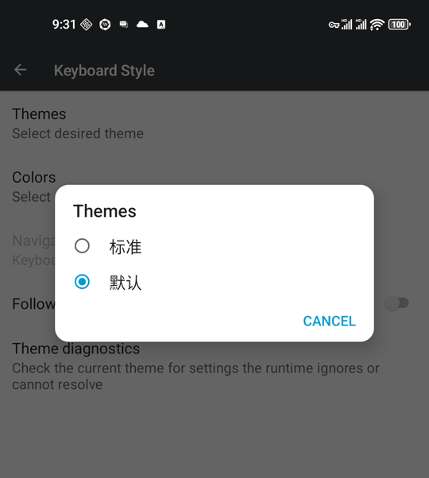
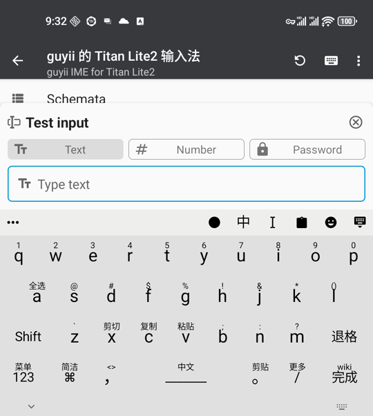
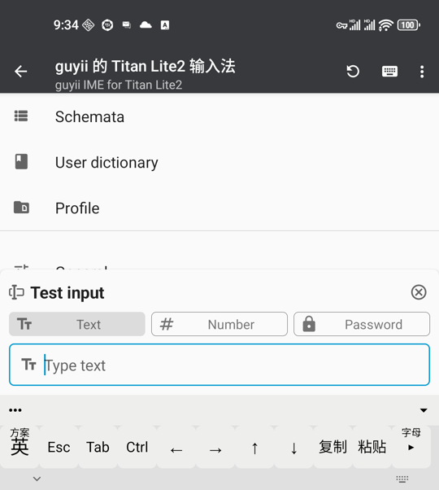
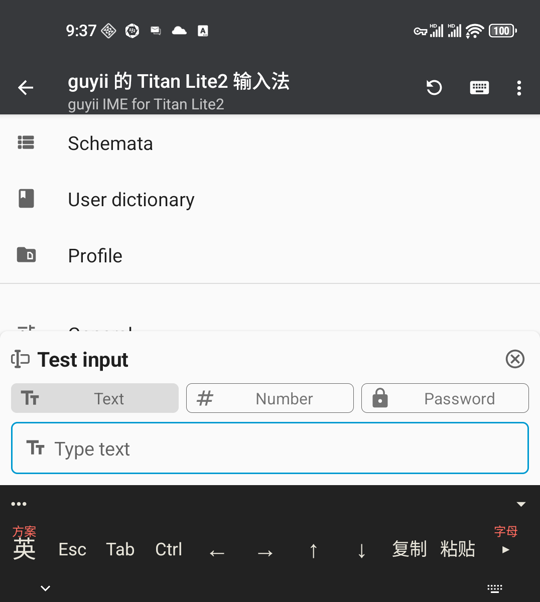
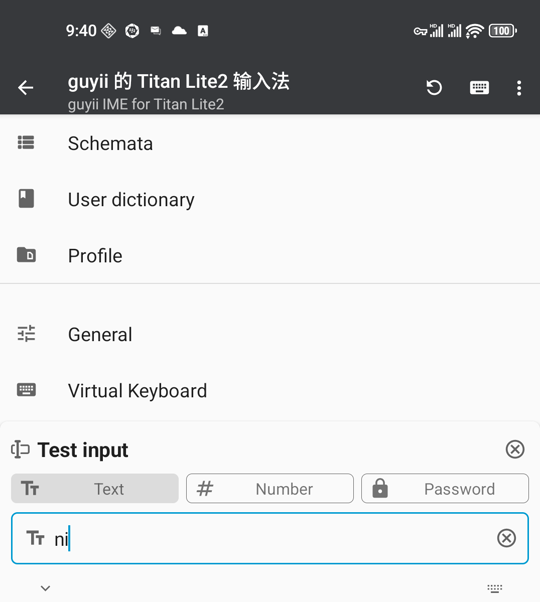
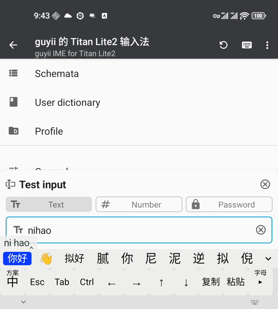
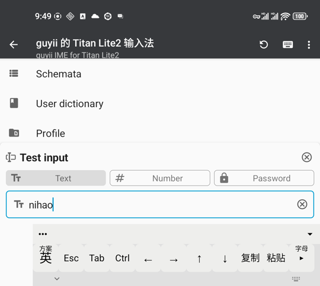
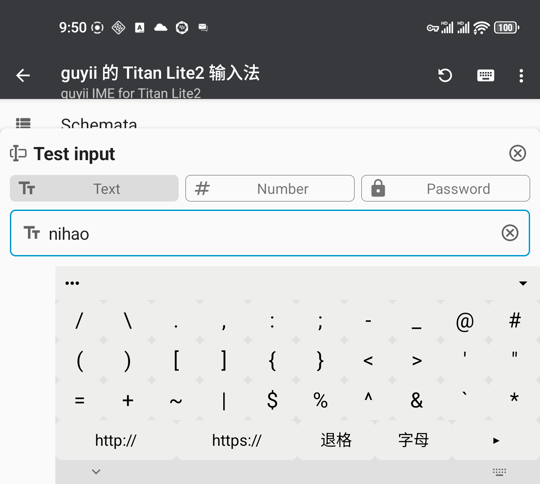
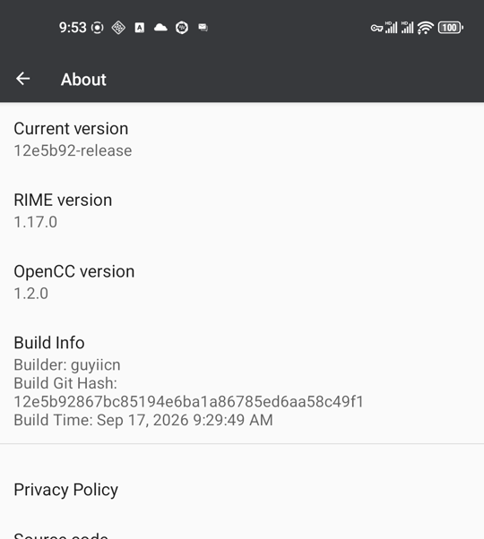

<!--
SPDX-FileCopyrightText: 2026 guyii
SPDX-License-Identifier: GPL-3.0-or-later
-->

# 真机测试报告

覆盖自更新之外的全部功能面。重点不是「飞字能不能用」—— 那部分一直在测 ——
而是**从 Trime 继承下来、改造过程中可能被无意破坏的部分**。

## 环境

| | |
|---|---|
| 设备 | Unihertz **Titan 2 Elite**（系统上报名，非 Lite2） |
| 系统 | Android 16 / arm64-v8a |
| 分辨率 | 1080×1200（可用 1076×1200） |
| 版本 | 3.4.0，构建 `12e5b92` |
| 日期 | 2026-09-17 |
| 通道 | adb over Tailscale |

## 方法

按**控件文本**定位后再点击，不使用固定坐标。找不到目标控件即报错中止 ——
测试过程中触发过两次，均正确停下。

> 此前用坐标盲点导致误触拨号盘、弹出「选择 SIM 卡拨打电话」（已取消，`mCallState=0`，未拨出）。
> 之后改为控件定位。

**教训**：判断键盘是否渲染**必须看截图**。键盘是绘制出来的，不在无障碍控件树里，
用 `find('Esc')` 判断曾得出「功能行未恢复」的错误结论，截图证明它其实是好的。

---

## 结果总览

| # | 测试项 | 结果 |
|---|---|---|
| 1 | 主题切换 | ⚠️ 功能行丢失，但可恢复 |
| 2 | 配色切换（37 套） | ✅ |
| 3 | 显示候选词窗口 | 🔴 非默认值会破坏输入法 |
| 4 | 候选行布局 | ✅ |
| 5 | 横屏（功能行 / 候选 / 符号页） | ✅ |
| 6 | 方案管理 | ✅ |
| 7 | 用户词典 | ✅ |
| 8 | 配置目录与同步 | ✅ |
| 9 | 常规 / 高级 / 剪贴板设置 | ✅ |
| 10 | 关于页（版本号显示） | ✅ |
| 11 | 隐私政策链接 | 🔴 指向上游 → **已修** |
| 12 | 开发者页 / 实时日志 | ✅ |
| 13 | 手动部署 | ✅ 无词库重建 |
| 14 | 实体键盘与飞字 | ✅ 全部通过（用户实测） |

---

## 1. 主题切换 ⚠️

换到「标准」(tongwenfeng) 后：

**功能行完全消失**，变成该主题自带的整块 QWERTY 大键盘，工具栏也换成了它自己的一套。

换回「默认」后完整恢复：

| 项 | 结果 |
|---|---|
| 应用崩溃 | 否 |
| **能否换回** | **能**，不会锁死 |

**根因**：`tongwenfeng.trime.yaml` 中 `rime_ice` 与 `guyii_sym1` 均为 0 个。
主题一换，`smartMatchKeyboard()` 找不到同名键盘，回退到该主题的 `default`。

**影响面比这两个主题更大**：`ThemeManager.getAllThemes()` 会扫描用户目录，
今后自行添加的任何主题都是同样结果。

**建议**（待定）：在主题解析完成后**由代码注入** guyii 的键盘与 preset_keys，
一处定义对所有主题生效。不建议把定义复制进每个主题文件 —— 只能覆盖现有主题，
且两份定义需手工同步。

> 附带发现有利于该方案：换主题后连工具栏样式都变了，说明注入的按键会自动沿用
> 目标主题的样式，视觉上是融合而非突兀。

## 2. 配色切换 ✅

换「暗堂／Dark Temple」后功能行变深色底白字、长按提示变红，**布局与全部按键均在**。

印证了主题与配色是两层：`onColorChangeListener` 只调 `refreshColors()` 重新上色，
不像 `onThemeChangeListener` 那样 `replaceInputViews()` 重建。

## 3. 显示候选词窗口 🔴

默认 `Disable`。改为「依输入设备」后按下实体键盘：

**功能行整个消失**，候选不出现，`ni` 直接以英文上屏 —— 输入法退化为空壳。

四个选项中只有 `Disable` 可用（`InputDeviceManager.kt:88`：
`DISABLED → useVirtualKeyboard = true`）。其余三项对这台机器没有任何合理用途。

**建议**：隐藏该设置，或仅保留 `Disable`。

## 4. 候选行布局 ✅

10 个候选均匀铺满整行，高亮在首位，每个大致对应一个功能键正上方 ——
正是「横滑选、上滑确认」所需的布局。

## 5. 横屏 ✅

| 项 | 结果 |
|---|---|
| 功能行 | 11 键齐全，比例正常，无变形 |
| 候选行 | 10 个候选，与竖屏一致 |
| 四行符号页 | 35 键完整，**未截断未压扁** |

**此前的担心是多余的**。曾判断「我的键盘没有 `landscape_keyboard` 变体，横屏后果未知」——
实际因每个键盘都设了 `keyboard_height` 且宽度用百分比，横屏自然适配。

横屏下键盘左右留白不铺满，是「自动分割键盘比例 100%」的正常表现。

## 10–11. 关于页与隐私政策

`RIME version 1.17.0` / `OpenCC version 1.2.0` 正常显示 ——
这正是给 `runCmd` 补回退值的效果（原生依赖改为随仓库分发后 `git describe` 失效，
不修此处会是空白）。

**隐私政策链接指向 `github.com/osfans/trime/blob/develop/PRIVACY.md`** ——
上游地址，而非本项目重写的那份。改造时漏掉的硬编码常量。

**已修**：改为从 `BuildConfig.BUILD_GIT_REPO` 推导。「源代码」链接本就正确
（它读的是 git remote）。

## 13. 手动部署 ✅

`finished updating schemas: 3 success, 0 failure`，**`round #` 计数 0** ——
未触发词库重建，固定 mtime 机制有效。

## 14. 实体键盘与飞字 ✅

由用户在真机实测（触摸板与实体键无法通过 adb 模拟）：

| 项 | 结果 |
|---|---|
| 飞字三手势（横滑移高亮 / 上滑确认 / 下滑退格） | ✅ |
| Shift+Alt 英文标点层 | ✅ |
| Shift+空格 中英切换 | ✅ |
| 屏幕 Ctrl + 实体 A 全选 | ✅ |
| 四行符号页与翻页 | ✅ |

---

## 设置与本项目设计的冲突

| 设置项 | 冲突 | 处置 |
|---|---|---|
| **隐藏输入工具栏** | 把整个输入条设为 `GONE`，候选行在其中 —— 等于同时废掉候选与飞字 | **已移除该设置** |
| **显示候选词窗口** | 非 `Disable` 的三项均会使功能行在使用实体键盘时消失 | 待定 |
| **横向候选词样式** | 显示 `Never fill width`，实际是填满的 —— 为飞字将该分支 `flexGrow` 由 0 改为 1 所致，设置名与行为不符 | 待定 |
| **切换中英文模式时显示提示** | 实测不显示（提示写入编码区，无编码时不渲染），已由常驻的 `中/英` 键替代 | 待定 |
| **每行最大候选词数** | 仅在「自动填充」样式下生效，默认样式下本就不起作用 | 无需处理 |
| ~~四个「拦截 Ctrl+X」~~ | ~~与实体键盘快捷键冲突~~ | **判断错误**：仅对软键盘按键生效，实体键盘走 `onKeyDown` 完全不经过；四项默认均为 `false`。功能行的复制/粘贴经用户实测正常 |

> 最后一行是本次测试中被推翻的推断。原判断仅依据设置项名称，未查调用链。
> 本报告其余结论均附代码位置或截图。

---

## 复现方式

驱动脚本 `ui.py`（按控件文本定位）未随仓库分发 —— 它依赖特定的设备地址与屏幕状态。
需要时可重建：`uiautomator dump` 取控件树 → 按 text/resource-id 匹配 → `input tap` 点击中心点，
匹配不到即中止。
